  

Vienna, Austria · <a href="https://artiz.github.io/">CV</a> · <a href="https://www.linkedin.com/in/artem-kustikov-2635917/">LinkedIn</a>

---

## About

Hands-on software architect with 20+ years of shipping production systems end to end.
I design and build AI/LLM-powered platforms, event-driven data pipelines and full-stack products,
and I still write most of the code myself.

> Taking GenAI, streaming and platform ideas from whiteboard to governed, observable production.

## Focus

- **GenAI & agentic systems**: self-service agent platforms, LLM-as-a-Judge evaluation, Langfuse observability, MCP with OAuth2, Azure AI Foundry, AWS Bedrock.
- **Streaming & backend**: Kafka, Confluent, Flink, Quarkus, reactive Java.
- **Platform engineering**: Kubernetes, Terraform, ArgoCD, GitHub Actions with OIDC, Azure and AWS.

## Featured Projects

| Project | What it is |
|:---:|---|
|  [docling.rs](https://github.com/docling-project/docling.rs) | Rust reimplementation of Docling, adopted into the official Docling project. 20+ document formats into RAG-ready output, up to 46× faster and 2–57× leaner on memory than Python, with Node.js bindings. |
|  [KateChat](https://github.com/artiz/kate-chat) | Self-hosted multi-provider LLM chat platform: Bedrock, OpenAI, RAG on Docling, MCP tool servers, in-browser Python. |

## Tech Stack

| Area | Tools |
|---|---|
| **AI / LLM** | LLM agents · Azure OpenAI · Azure AI Foundry · AWS Bedrock · LangChain · PydanticAI · MCP · RAG · Langfuse · LLM-as-a-Judge · Whisper |
| **ML & Data** | Python · Rust · PyTorch · scikit-learn · ONNX Runtime · NumPy · Pandas · NLTK · ETL pipelines |
| **Web** | TypeScript · React · Next.js · Node.js · GraphQL · Tailwind CSS · ReactFlow · WebSockets · WebRTC |
| **Backend & Streaming** | Java · Quarkus · Spring Boot · Rust · Go · Kafka · Flink · PostgreSQL · Redis · Cosmos DB |
| **Cloud & DevOps** | Azure · AWS · GCP · Kubernetes · Terraform · Helm · ArgoCD · GitHub Actions |

## Certifications

AWS Solutions Architect · HashiCorp Terraform Associate · Confluent Certified Developer for Apache Kafka · AWS Generative AI Applications · Microsoft AI & ML Engineering · Machine Learning & Data Analysis (MIPT / Yandex)
